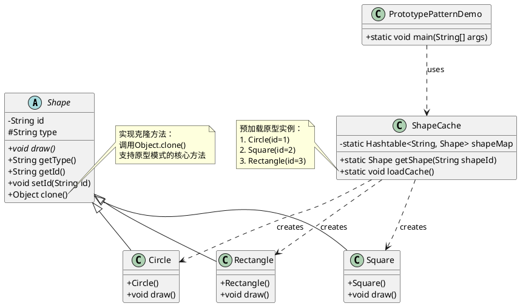
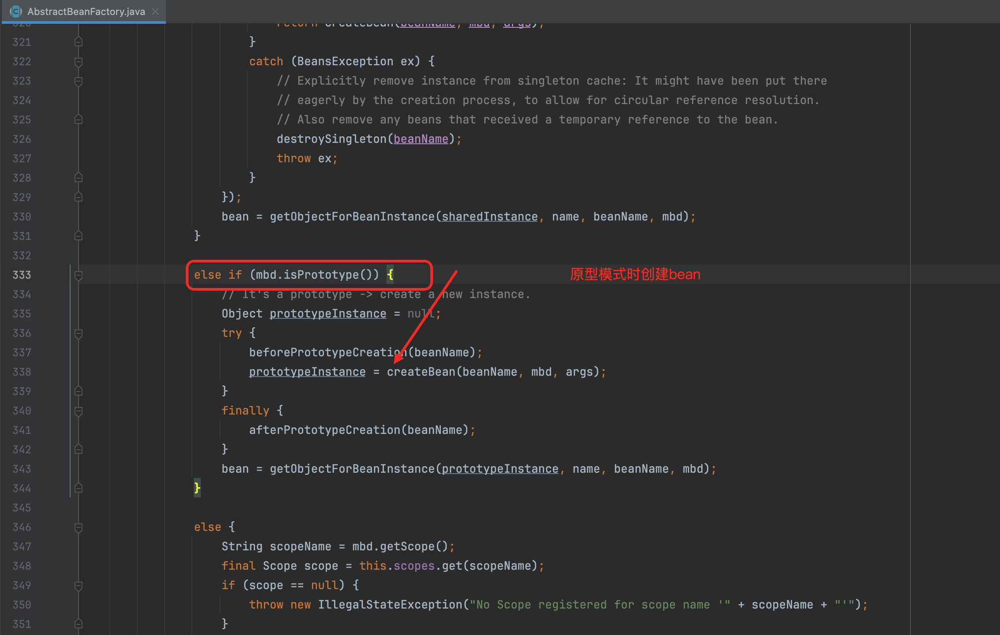
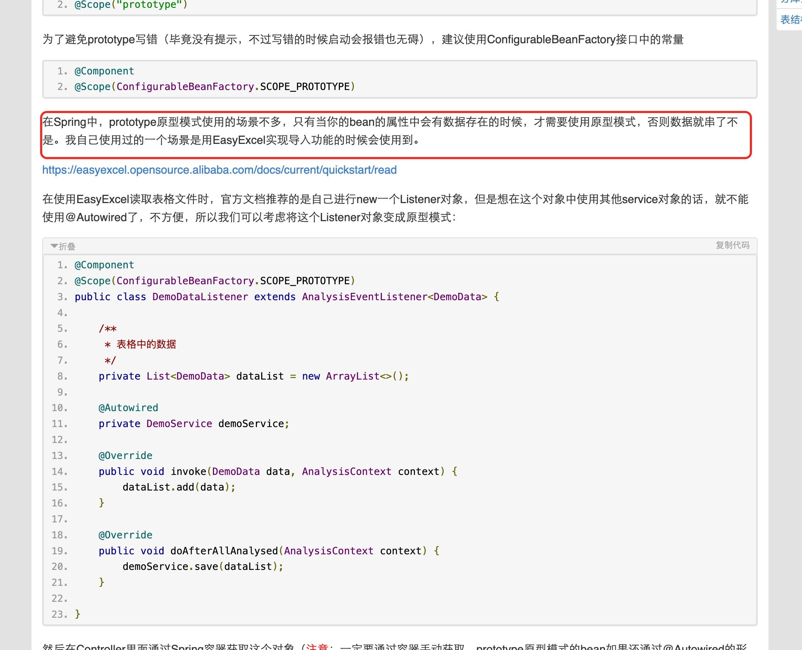

### 原型模式

原型模式（Prototype Pattern）是用于创建重复的对象，同时又能保证性能。这种类型的设计模式属于创建型模式，它提供了一种创建对象的最佳方式之一。

代码位置
[prototype](..%2F..%2Fsrc%2Fmain%2Fjava%2Fcom%2Fexample%2Fdesign%2Fprototype)

## 类图：

## spring 使用原型模式亦为多列：

 - 代码位置：org.springframework.beans.factory.support.AbstractBeanFactory.doGetBean
 - 截图：
   
## 使用场景：

参考：
https://qclog.cn/1365
https://www.runoob.com/design-pattern/prototype-pattern.html

