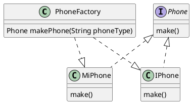
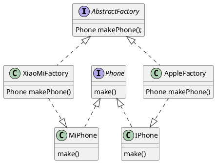
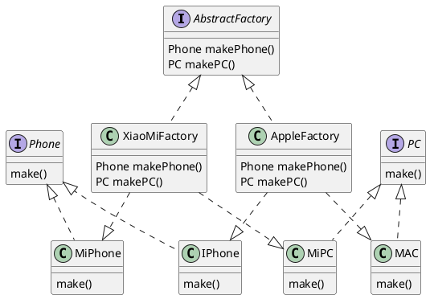

### 简单工厂模式



**Phone类**：手机标准规范类(AbstractProduct)

```
public interface Phone {
    void make();
}
```

**MiPhone类**：制造小米手机（Product1）

```
public class MiPhone implements Phone {
    public MiPhone() {
        this.make();
    }
    @Override
    public void make() {
        // TODO Auto-generated method stub
        System.out.println("make xiaomi phone!");
    }
}
```

**IPhone类**：制造苹果手机（Product2）

```
public class IPhone implements Phone {
    public IPhone() {
        this.make();
    }
    @Override
    public void make() {
        // TODO Auto-generated method stub
        System.out.println("make iphone!");
    }
}
```

**PhoneFactory类**：手机代工厂（Factory）

```
public class PhoneFactory {
    public Phone makePhone(String phoneType) {
        if(phoneType.equalsIgnoreCase("MiPhone")){
            return new MiPhone();
        }
        else if(phoneType.equalsIgnoreCase("iPhone")) {
            return new IPhone();
        }
        return null;
    }
}
```

**演示：**

```
public class Demo {
    public static void main(String[] arg) {
        PhoneFactory factory = new PhoneFactory();
        Phone miPhone = factory.makePhone("MiPhone");            // make xiaomi phone!
        IPhone iPhone = (IPhone)factory.makePhone("iPhone");    // make iphone!
    }
}
```

### 工厂方法模式



​**AbstractFactory类**​：生产不同产品的工厂的抽象类

```
public interface AbstractFactory {
    Phone makePhone();
}
```

​**XiaoMiFactory类**​：生产小米手机的工厂（ConcreteFactory1）

com/images/copycode.gif)](javascript:void(0); "复制代码")复制


```
public class XiaoMiFactory implements AbstractFactory{
    @Override
    public Phone makePhone() {
        return new MiPhone();
    }
}
```


​**AppleFactory类**​：生产苹果手机的工厂（ConcreteFactory2）


```
public class AppleFactory implements AbstractFactory {
    @Override
    public Phone makePhone() {
        return new IPhone();
    }
}
```


**演示：**
```
public class Demo {
    public static void main(String[] arg) {
        AbstractFactory miFactory = new XiaoMiFactory();
        AbstractFactory appleFactory = new AppleFactory();
        miFactory.makePhone();            // make xiaomi phone!
        appleFactory.makePhone();        // make iphone!
    }
}
```

### 抽象工厂模式



​**PC类**​：定义PC产品的接口(AbstractPC)

```
public interface PC {
    void make();
}
```

​**MiPC类**​：定义小米电脑产品(MIPC)


```
public class MiPC implements PC {
    public MiPC() {
        this.make();
    }
    @Override
    public void make() {
        // TODO Auto-generated method stub
        System.out.println("make xiaomi PC!");
    }
}
```


​**MAC类**​：定义苹果电脑产品(MAC)


```
public class MAC implements PC {
    public MAC() {
        this.make();
    }
    @Override
    public void make() {
        // TODO Auto-generated method stub
        System.out.println("make MAC!");
    }
}
```


下面需要修改工厂相关的类的定义：

​**AbstractFactory类**​：增加PC产品制造接口

```
public interface AbstractFactory {
    Phone makePhone();
    PC makePC();
}
```

​**XiaoMiFactory类**​：增加小米PC的制造（ConcreteFactory1）


```
public class XiaoMiFactory implements AbstractFactory{
    @Override
    public Phone makePhone() {
        return new MiPhone();
    }
    @Override
    public PC makePC() {
        return new MiPC();
    }
}
```


​**AppleFactory类**​：增加苹果PC的制造（ConcreteFactory2）


```
public class AppleFactory implements AbstractFactory {
    @Override
    public Phone makePhone() {
        return new IPhone();
    }
    @Override
    public PC makePC() {
        return new MAC();
    }
}
```


**演示：**


```
public class Demo {
    public static void main(String[] arg) {
        AbstractFactory miFactory = new XiaoMiFactory();
        AbstractFactory appleFactory = new AppleFactory();
        miFactory.makePhone();            // make xiaomi phone!
        miFactory.makePC();                // make xiaomi PC!
        appleFactory.makePhone();        // make iphone!
        appleFactory.makePC();            // make MAC!
    }
}
```


### 总结：

上面介绍的三种工厂模式有各自的应用场景，实际应用时能解决问题满足需求即可，可灵活变通，无所谓高级与低级。

此外无论哪种模式，由于可能封装了大量对象和工厂创建，新加产品需要修改已定义好的工厂相关的类，因此对于产品和工厂的扩展不太友好，利弊需要权衡一下。

### 参考：

[设计模式之工厂模式](https://www.cnblogs.com/yssjun/p/11102162.html)


