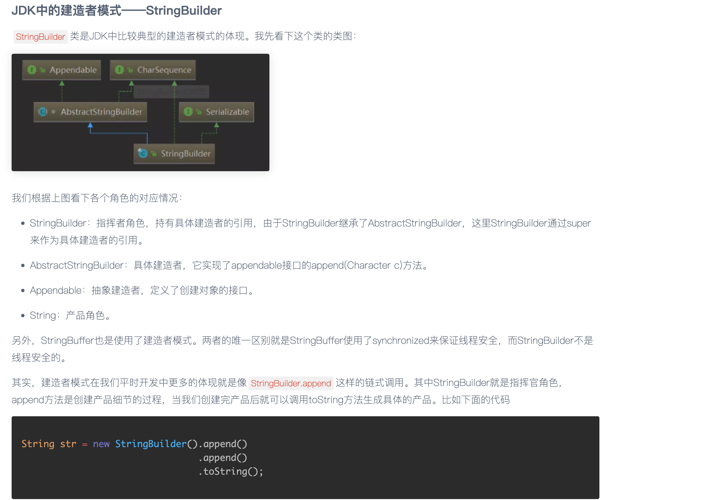

# 建造者模式
### 路径： [builder](src%2Fmain%2Fjava%2Fcom%2Fexample%2Fdesign%2Fbuilder)

### 优点
- 代码可读性高：链式调用清晰表达构建逻辑。
- 参数灵活：可选参数通过方法设置，避免无效构造器。
- 对象不可变性：适合创建不可变对象（属性通过构造器一次性赋值）。
### 适用场景
- 对象需要多个步骤或复杂逻辑构建。
- 存在大量可选参数或参数依赖关系。
- 需要构建不同表现形式的对象（例如：高配/低配电脑）。
- 总结：通过建造者模式，你可以更优雅地处理复杂对象的构造过程，让代码更易维护和扩展。

## 示例：
JDK中的建造者模式——StringBuilder

## 参考：
[建造者模式简介](https://www.cnblogs.com/54chensongxia/p/12409493.html)
