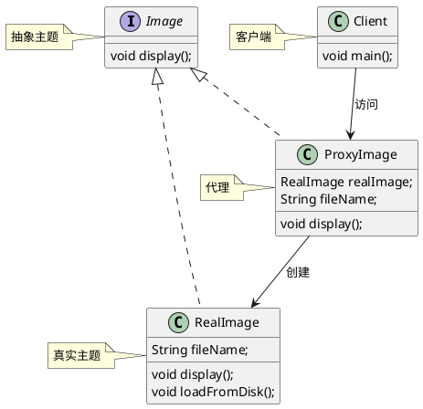
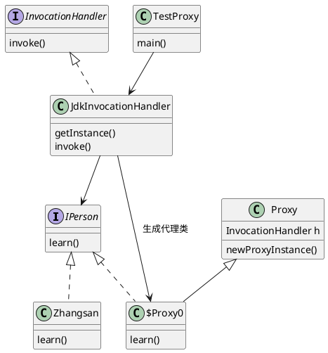
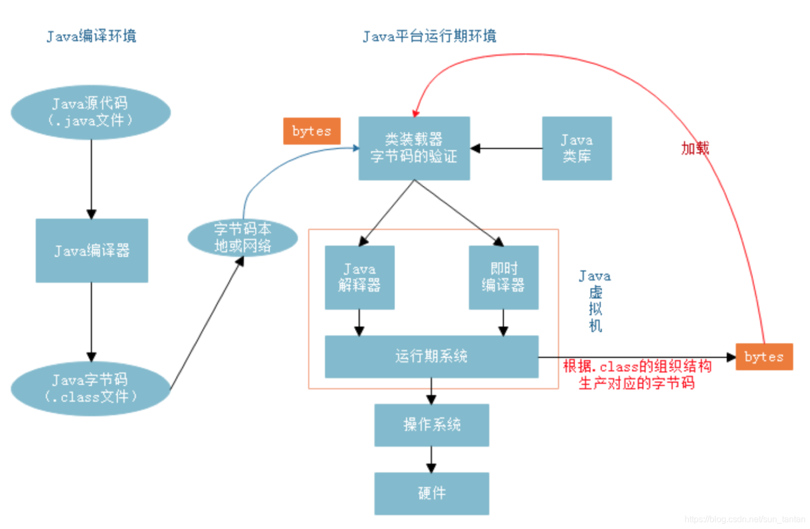

# 代理模式

代理模式的本质是一个中间件，主要目的是解耦合服务提供者和使用者。使用者通过代理间接的访问服务提供者，便于后者的封装和控制。是一种结构性模式。

### 1.目的

为外部调用者提供一个访问服务提供者的代理对象。

### 2.动机

限制对目标对象的直接访问，降低耦合度。

### 3.优缺点

**优点：**

* 低耦合
* 易扩展
* 灵活度高

**缺点：**

* 间接访问可能会延迟请求相应
* 增加工作量

### 4.应用实例

* 快捷方式：Windows系统中的快捷方式作为文件或程序的代理。
* 角色扮演：孙悟空作为高翠兰的代理，猪八戒无法区分。
* 代售点：购买火车票时，代售点作为火车站的代理。
* 支票：作为银行账户资金的代理，控制资金的访问。
* Spring AOP：使用代理模式来实现面向切面编程。

### 5.静态代理

* [Proxy](..%2F..%2Fsrc%2Fmain%2Fjava%2Fcom%2Fexample%2Fdesign%2FProxy)

* 如上目录中，为静态代理
  从 JVM 层面来说， **静态代理在编译时就将接口、实现类、代理类这些都变成了一个个实际的 class 文件。**

* 静态代理类图

### 6. 动态代理

#### 6.1 jdk 动态代理

* 实现一个JDK动态代理，
定义一个接口及其实现类；
自定义 InvocationHandler 并重写invoke方法，在 invoke 方法中我们会调用原生方法（被代理类的方法）并自定义一些处理逻辑；
通过 Proxy.newProxyInstance(ClassLoader loader,Class<?>[] interfaces,InvocationHandler h) 方法创建代理对象；
* JDK动态代理就是通过程序来动态生成Class文件的
https://www.cnblogs.com/liujiarui/p/12408742.html  此博客有详细分析

* jdk动态代理类图

#### 6.2 cglib动态代理

##### 6.2.1 ASM

* 需要手动操纵字节码的需求，可以使用ASM，应用场景有AOP（Cglib就是基于ASM）、热部署、修改其他jar包中的类等
* 运行时转换流程
  对jvm方法区中类定义进行替换，因为堆(heap)中的Class对象是对方法区对象的封装，所以可以理解为对Class对象的替换。
  对于一个对象方法的调用，可以理解为不改变对象头中的指向类的指针本身，而是只改变了内容。当一个class被替换后，系统无需重启，替换的类会立即生效

（1）线程私有区：

程序计数器，记录正在执行的虚拟机字节码的地址；
虚拟机栈：方法执行的内存区，每个方法执行时会在虚拟机栈中创建栈帧；
本地方法栈：虚拟机的Native方法执行的内存区；
（2）线程共享区：

Java堆：对象分配内存的区域；
方法区：存放类信息、常量、静态变量、编译器编译后的代码等数据；
常量池：存放编译器生成的各种字面量和符号引用，是方法区的一部分。
对于大多数的程序员来说，Java内存比较流行的说法便是堆和栈，这其实是非常粗略的一种划分，这种划分的”堆”对应内存模型的Java堆，”栈”是指虚拟机栈，然而Java内存模型远比这更复杂，想深入了解Java的内存，还是有必要明白整个内存模型。

##### 6.2.2 Instrument

* instrument是JVM提供的一个可以修改已加载类的类库

参考：

https://www.runoob.com/design-pattern/proxy-pattern.html
https://www.cnblogs.com/yssjun/p/10889022.html
https://blog.csdn.net/sun_tantan/article/details/118609837

[Java动态代理Proxy类源码分析](https://www.cnblogs.com/liujiarui/p/12408742.html "发布于 2020-11-08 11:27")

