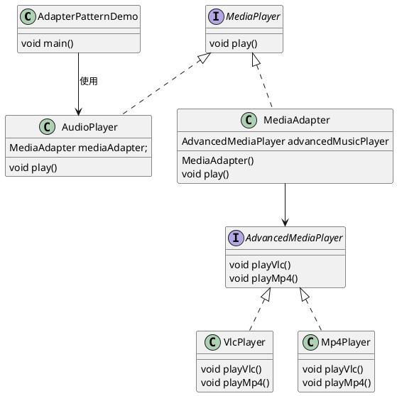

# 适配器模式

## 理解适配器模式

[Adapter](src%2Ftest%2Fjava%2Fcom%2Fexample%2Fdesign%2FAdapter)

适配器模式（Adapter Pattern）充当两个不兼容接口之间的桥梁，属于结构型设计模式。它通过一个中间件（适配器）将一个类的接口转换成客户期望的另一个接口，使原本不能一起工作的类能够协同工作。


### 举例

* 电源适配器
  
  如果你是第一次从美国到欧洲旅行， 那么在给笔记本充电时可能会大吃一惊。
  不同国家的电源插头和插座标准不同。 美国插头和德国插座不匹配。
  同时提供美国标准插座和欧洲标准插头的电源适配器可以解决你的难题。
* 音频适配器
  
  读卡器是作为内存卡和笔记本之间的适配器。您将内存卡插入读卡器，
  再将读卡器插入笔记本，这样就可以通过笔记本来读取内存卡。

## Java代码中使用适配器的例子

java.util.Arrays.asList



```
步骤 1
为媒体播放器和更高级的媒体播放器创建接口。

MediaPlayer.java
public interface MediaPlayer {
   public void play(String audioType, String fileName);
}
AdvancedMediaPlayer.java
public interface AdvancedMediaPlayer { 
   public void playVlc(String fileName);
   public void playMp4(String fileName);
}
步骤 2
创建实现了 AdvancedMediaPlayer 接口的实体类。

VlcPlayer.java
public class VlcPlayer implements AdvancedMediaPlayer{
   @Override
   public void playVlc(String fileName) {
      System.out.println("Playing vlc file. Name: "+ fileName);      
   }
 
   @Override
   public void playMp4(String fileName) {
      //什么也不做
   }
}
Mp4Player.java
public class Mp4Player implements AdvancedMediaPlayer{
 
   @Override
   public void playVlc(String fileName) {
      //什么也不做
   }
 
   @Override
   public void playMp4(String fileName) {
      System.out.println("Playing mp4 file. Name: "+ fileName);      
   }
}
步骤 3
创建实现了 MediaPlayer 接口的适配器类。

MediaAdapter.java
public class MediaAdapter implements MediaPlayer {
 
   AdvancedMediaPlayer advancedMusicPlayer;
 
   public MediaAdapter(String audioType){
      if(audioType.equalsIgnoreCase("vlc") ){
         advancedMusicPlayer = new VlcPlayer();       
      } else if (audioType.equalsIgnoreCase("mp4")){
         advancedMusicPlayer = new Mp4Player();
      }  
   }
 
   @Override
   public void play(String audioType, String fileName) {
      if(audioType.equalsIgnoreCase("vlc")){
         advancedMusicPlayer.playVlc(fileName);
      }else if(audioType.equalsIgnoreCase("mp4")){
         advancedMusicPlayer.playMp4(fileName);
      }
   }
}
步骤 4
创建实现了 MediaPlayer 接口的实体类。

AudioPlayer.java
public class AudioPlayer implements MediaPlayer {
   MediaAdapter mediaAdapter; 
 
   @Override
   public void play(String audioType, String fileName) {    
 
      //播放 mp3 音乐文件的内置支持
      if(audioType.equalsIgnoreCase("mp3")){
         System.out.println("Playing mp3 file. Name: "+ fileName);         
      } 
      //mediaAdapter 提供了播放其他文件格式的支持
      else if(audioType.equalsIgnoreCase("vlc") 
         || audioType.equalsIgnoreCase("mp4")){
         mediaAdapter = new MediaAdapter(audioType);
         mediaAdapter.play(audioType, fileName);
      }
      else{
         System.out.println("Invalid media. "+
            audioType + " format not supported");
      }
   }   
}
步骤 5
使用 AudioPlayer 来播放不同类型的音频格式。

AdapterPatternDemo.java
public class AdapterPatternDemo {
   public static void main(String[] args) {
      AudioPlayer audioPlayer = new AudioPlayer();
 
      audioPlayer.play("mp3", "beyond the horizon.mp3");
      audioPlayer.play("mp4", "alone.mp4");
      audioPlayer.play("vlc", "far far away.vlc");
      audioPlayer.play("avi", "mind me.avi");
   }
}
```

## JDK 中，适配器模式被用于多个类的设计

### **1. `InputStreamReader`**

#### **目标场景**

将字节流（`InputStream`/`OutputStream`）适配为字符流（`Reader`/`Writer`），解决字节与字符编码的兼容问题。

#### **结构分析**

* **目标接口（Target）**：`Reader`（字符输入流的抽象接口）。
* **被适配者（Adaptee）**：`InputStream`（字节输入流）。
* **适配器（Adapter）**：`InputStreamReader`，通过继承 `Reader` 并持有 `InputStream` 实例，将字节流转换为字符流。

#### **代码示例**

```
// 目标接口：Reader
public abstract class Reader implements Readable, Closeable { /*...*/ }

// 适配器：InputStreamReader
public class InputStreamReader extends Reader {
    private final InputStream in; // 被适配者

    public InputStreamReader(InputStream in) {
        this.in = in;
    }

    @Override
    public int read(char[] cbuf, int off, int len) throws IOException {
        // 将字节读取转换为字符解码
        return in.read(cbuf, off, len); // 实际调用 InputStream 的方法
    }
}
```


---

### **2. `Arrays.asList()` 返回的列表**

#### **目标场景**

将数组适配为 `List` 接口，使其支持列表操作（如 `add`, `remove` 等需抛异常，因数组不可变）。

#### **结构分析**

* **目标接口（Target）**：`List` 接口。
* **被适配者（Adaptee）**：数组（如 `String[]`）。
* **适配器（Adapter）**：`Arrays` 内部类 `ArrayList`（非 `java.util.ArrayList`），通过包装数组实现 `List` 接口。

#### **代码示例**

```
// 目标接口：List
public interface List<E> extends Collection<E> { /*...*/ }

// 适配器：Arrays.ArrayList（内部类）
private static class ArrayList<E> extends AbstractList<E> implements RandomAccess {
    private final E[] a; // 被适配的数组

    ArrayList(E[] array) {
        a = Objects.requireNonNull(array);
    }

    @Override
    public E get(int index) {
        return a[index]; // 直接代理数组的访问
    }

    @Override
    public int size() {
        return a.length;
    }
}

// 使用适配器
List<String> list = Arrays.asList(new String[]{"A", "B"});
```


## 参考：

[适配器模式](https://refactoringguru.cn/design-patterns/adapter)

[菜鸟-适配器模式](https://www.runoob.com/design-pattern/adapter-pattern.html)

