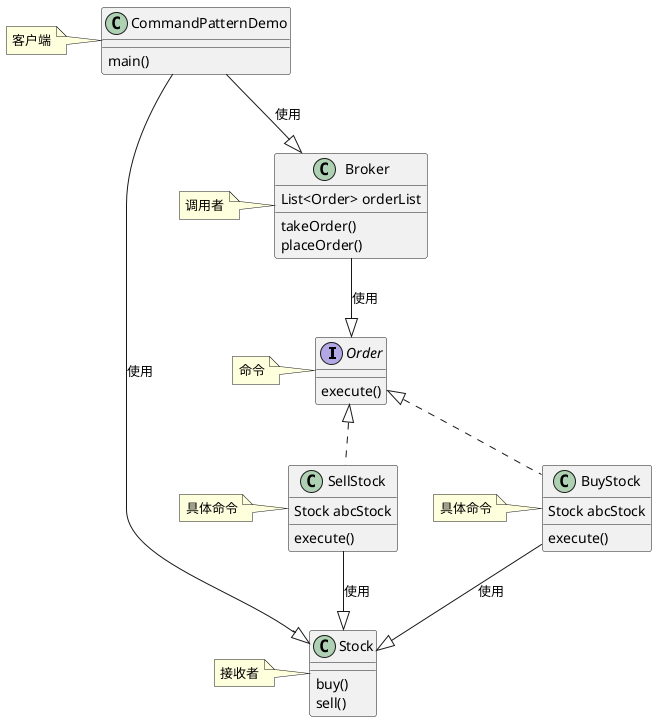

# 命令模式

- 主要解决问题：
    - 将命令封装为一个对象，解决命令与执行之间紧耦合问题，如事务需要撤销。
- 实现方式
  - 定义命令接口：所有命令必须实现的接口。
  - 创建具体命令：实现命令接口的具体类，包含执行请求的方法。
  - 调用者：持有命令对象并触发命令的执行。
  - 接收者：实际执行命令的对象。

- Order-命令模式类图
    - 位置：[Command](..%2F..%2Fsrc%2Fmain%2Fjava%2Fcom%2Fexample%2Fdesign%2FCommand)
