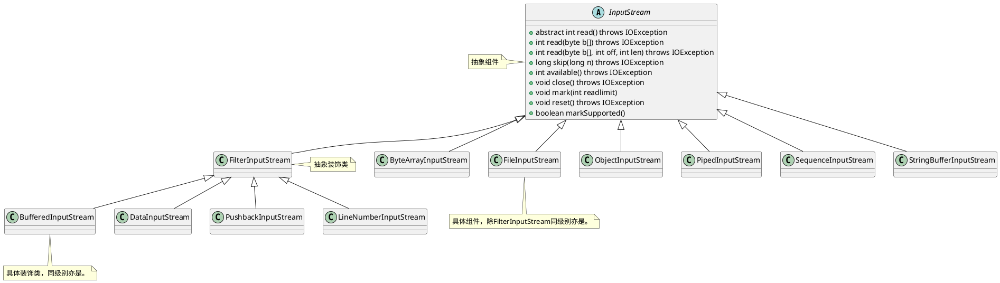

# 装饰器模式

装饰器模式（Decorator Pattern）允许向一个现有的对象添加新的功能，同时又不改变其结构。
这种类型的设计模式属于结构型模式，它是作为现有的类的一个包装。

- 解决问题：
  - 具体装饰类封装原对象，在原有基础上动态添加新功能，从而替代继承，减少子类。
- 使用场景：
  - 当需要在不增加大量子类的情况下扩展类的功能。
  - 当需要动态地添加或撤销对象的功能。
- 实现方式
  - **抽象组件**：创建一个接口或抽象类，规定可以动态添加职责的对象的标准。
  - **具体组件**：实现该接口的具体类，提供基本功能。
  - **抽象装饰者**：实现同样的接口，持有一个组件接口的引用，可以在任何时候动态地添加功能。
  - **具体装饰者**：扩展抽象装饰者，添加额外的职责。
- 代码位置：
  - [Decorator](..%2F..%2Fsrc%2Fmain%2Fjava%2Fcom%2Fexample%2Fdesign%2FDecorator)
- 类图

- 代码路径
[JDKDecorator](..%2F..%2Fsrc%2Fmain%2Fjava%2Fcom%2Fexample%2Fdesign%2FDecorator%2FJDKDecorator)

参考：
[装饰器模式](https://www.runoob.com/design-pattern/decorator-pattern.html)
[《java与设计模式》之装饰模式详解&Java IO中的装饰器模式](https://blog.csdn.net/caihuangshi/article/details/51334097)