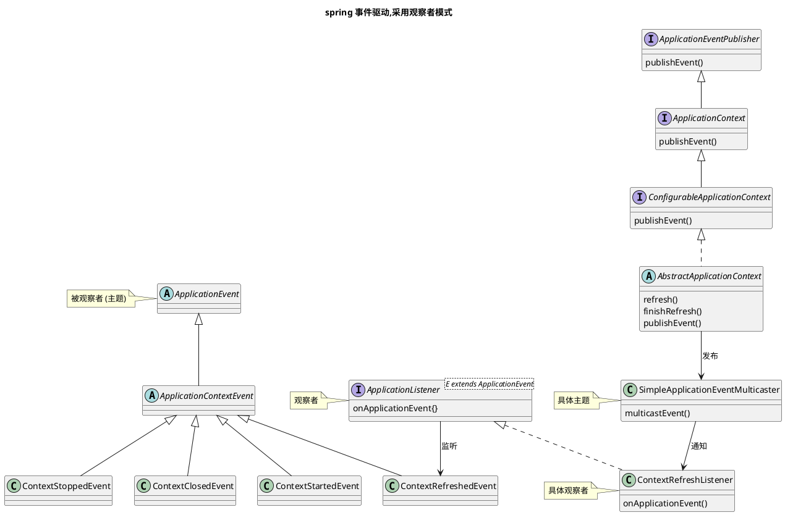

# 观察者模式

观察者模式是一种行为型设计模式，它定义了一种一对多的依赖关系，当一个对象的状态发生改变时，其所有依赖者都会收到通知并自动更新。


项目路径：
[Product](..%2Fsrc%2Ftest%2Fjava%2Fcom%2Fexample%2Fdesign%2FObserver%2FProduct)

## spring 事务使用观察者模式：

### 事务回调机制：

```
回调注册，示例代码：
TransactionSynchronizationManager.registerSynchronization( )

源码位置：org.springframework.transaction.support.TransactionSynchronizationManager#registerSynchronization

源码事务提交后，回调触发位置：
org.springframework.transaction.support.AbstractPlatformTransactionManager#triggerAfterCommit
```

### spring 事件机制使用观察者模式：



#### 示例：

自定义事件类

```
package com.example.springbootmy.event;

import org.springframework.context.ApplicationEvent;

// 自定义事件类
public class MyEvent extends ApplicationEvent {
 
  private String message;
 
  public MyEvent(Object source, String message) {
    super(source);
    this.message = message;
  }
 
  public String getMessage() {
    return message;
  }
}
```

事件监听器

```
package com.example.springbootmy.event;

import org.springframework.context.ApplicationListener;
import org.springframework.stereotype.Component;

// 事件监听器
@Component
public class MyEventListener implements ApplicationListener<MyEvent> {
  // 事件发生时执行
  @Override
  public void onApplicationEvent(MyEvent event) {
    System.out.println("接收到事件: " + event.getMessage());
    // 模拟事件处理
    try {
      Thread.sleep(3000);
    } catch (InterruptedException e) {
      throw new RuntimeException(e);
    }
  }
}
```

腐恶费
[源码地址](https://github.com/feifeihappy/spring-boot/tree/2.1.x/spring-boot-project/spring-boot-my/src/main/java/com/example/springbootmy/event)

## 参考：

- [设计模式之观察者模式](https://www.cnblogs.com/yssjun/p/11107038.html)
- [观察者模式](https://www.runoob.com/design-pattern/observer-pattern.html)
