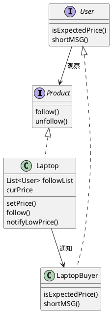

# 观察者模式

```plantuml
@startuml
'https://plantuml.com/class-diagram

interface Product{
follow()
unfollow()
}

interface User{
isExpectedPrice()
shortMSG()
}

User-->Product : 观察

class Laptop implements Product{
List<User> followList
curPrice
setPrice()
follow()
notifyLowPrice()

}
class LaptopBuyer implements User{
isExpectedPrice()
shortMSG()
}

Laptop-->LaptopBuyer : 通知
'LaptopBuyer-->User : 发短信
@enduml
```
项目路径：
[Product](..%2Fsrc%2Ftest%2Fjava%2Fcom%2Fexample%2Fdesign%2FObserver%2FProduct)

参考：[设计模式之观察者模式](https://www.cnblogs.com/yssjun/p/11107038.html)