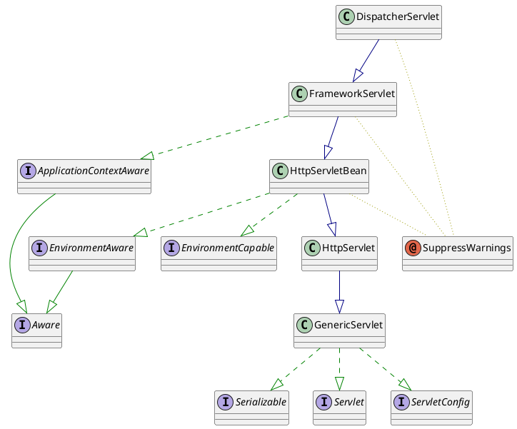
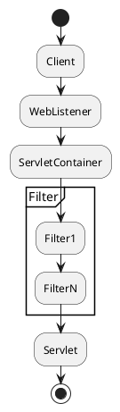
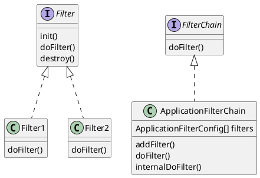

# 责任链模式

## 1 概述：

责任链模式（Chain of Responsibility Pattern）是将链中每一个节点看作是一个对象，
且内部自动维护下一节点对象。请求从责任链的一头发出，沿着责任链依次传递，符合条件执行自有逻辑且传递给下一节点，属于行为型模式。

* 主要解决问题：
  * 解耦发送者和接收者。多对象可能处理同一请求，而发送者无需知道哪个对象处理，发送者只关心结果。
* 现实类比：
  * 足球比赛：层层传递，符合条件射门。
  * 击鼓传花：层层传递，符合条件（音乐停止），对应同学唱歌。
  * 审批流程：层层传递，符合条件（审批通过），对应下一节点审批。

## 2. 开源框架中责任链模式应用

### 2.1 SpringMVC

```
Interceptor
```

- DispatcherServlet 继承图



### 2.2 Servlet Filter

- Filter过滤器对Servlet容器的请求和响应对象进行检查和修改，是个典型的责任链。
- 在Servlet被调用之前检查Request对象并支持修改Request Header和Request内容
- 在Servlet被调用之后检查Response对象并支修改Response Header和Response内容。

- Filter 执行顺序



- Filter 责任链模式涉及类图



#### 2.2.1 处理器介绍

```java
public interface Filter {
    public void init(FilterConfig filterConfig) throws ServletException;
    public void doFilter ( ServletRequest request, ServletResponse response, FilterChain chain ) throws IOException, ServletException;
    public void destroy();
}
 
public class TimeFilter implements Filter {
 
    @Override
    public void init(FilterConfig filterConfig) throws ServletException {
        System.out.println("time filter init");
    }
 
    @Override
    public void doFilter(ServletRequest servletRequest, ServletResponse servletResponse, FilterChain filterChain) throws IOException, ServletException {
        // 1、执行处理的逻辑
        System.out.println("time filter doFilter");
 
        // 2、执行责任链当中的下一个 Filter 对象，等价于执行 FilterChain 的internalDoFilter方法
        filterChain.doFilter(servletRequest, servletResponse);
    }
}
```

说明：

* Servlet过滤器类要实现javax.servlet.Filter接口，该接口定义了通用的3个方法。
* init方法：负责Servlet过滤器的初始化方法，Servlet容器创建Servlet过滤器实例过程中调用这个方法。
* doFilter方法：当客户请求访问与过滤器关联的URL时，Servlet容器会调用该方法。
* destroy方法：Servlet容器在销毁过滤器实例前调用该方法，可以释放过滤器占用的资源。

#### 2.2.2 责任链构建

```java
public final class ApplicationFilterChain implements FilterChain {
 
    // 责任链上 Filter 的维护对象
    private ApplicationFilterConfig[] filters = new ApplicationFilterConfig[0];
    //责任链上待执行的 Filter 对象
    private int pos = 0;
    // 责任链上拥有的 Filter 数量
    private int n = 0;
 
    void addFilter(ApplicationFilterConfig filterConfig) {
 
        // 避免重复添加Filter
        for(ApplicationFilterConfig filter:filters)
            if(filter==filterConfig)
                return;
        // 按需进行扩容
        if (n == filters.length) {
            ApplicationFilterConfig[] newFilters =
                new ApplicationFilterConfig[n + INCREMENT];
            System.arraycopy(filters, 0, newFilters, 0, n);
            filters = newFilters;
        }
        // 保存Filter 对象
        filters[n++] = filterConfig;
 
    }
}
```

说明：

* ApplicationFilterChain作为Filter的责任链，负责责任链的构建和执行。
* 责任链通过ApplicationFilterConfig类型的数组对象filters保存Filter处理器。
* 责任链上处理器的添加通过保存到数组filters来实现。

#### 2.2.3 责任链执行

```java
public final class ApplicationFilterChain implements FilterChain {
 
    // 责任链上 Filter 的维护对象
    private ApplicationFilterConfig[] filters = new ApplicationFilterConfig[0];
    //责任链上待执行的 Filter 对象
    private int pos = 0;
    // 责任链上拥有的 Filter 数量
    private int n = 0;
 
    // 责任链的执行
    private void internalDoFilter(ServletRequest request,
                                  ServletResponse response)
        throws IOException, ServletException {
 
        // 在责任链未执行完的情况下执行责任链         if (pos < n) {
            // 获取当前待执行的 Filter，同时递增下一次待执行责任链的下标
            ApplicationFilterConfig filterConfig = filters[pos++];
            try {
                Filter filter = filterConfig.getFilter();
 
                if( Globals.IS_SECURITY_ENABLED ) {
                    // 省略相关代码
                } else {
                    filter.doFilter(request, response, this);
                }
            } catch (Throwable e) {
            }
            return;
        }
 
        try {
            if ((request instanceof HttpServletRequest) &&
                    (response instanceof HttpServletResponse) &&
                    Globals.IS_SECURITY_ENABLED ) {
                // 执行正常的业务逻辑
            } else {
                servlet.service(request, response);
            }
        } catch (Throwable e) {
            e = ExceptionUtils.unwrapInvocationTargetException(e);
            throw new ServletException(sm.getString("filterChain.servlet"), e);
        }
    }
}
```

说明：

* 整个责任链上Filter处理器的执行通过处理器自驱进行实现，而非由责任链对象驱动。
* Filter处理器的在处理过程中除了执行自我逻辑，会通过 filterChain.doFilter(servletRequest, servletResponse) 触发下一个处理器的执行。

## 参考：

[开源框架中责任链应用](https://www.cnblogs.com/vivotech/p/17719327.html)

Spring MVC源码解析
https://www.cnblogs.com/javammc/p/15612780.html

SpringMVC工作原理
https://www.cnblogs.com/xiaoxi/p/6164383.html

