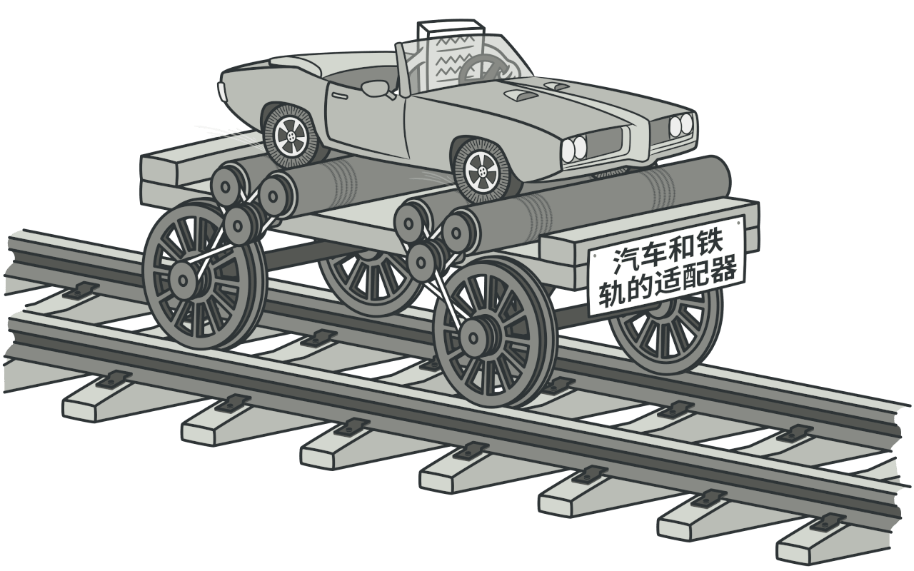
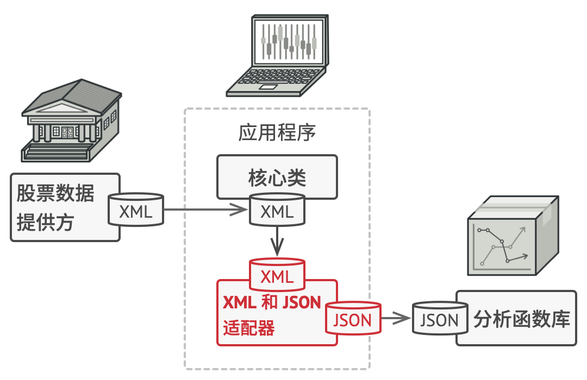
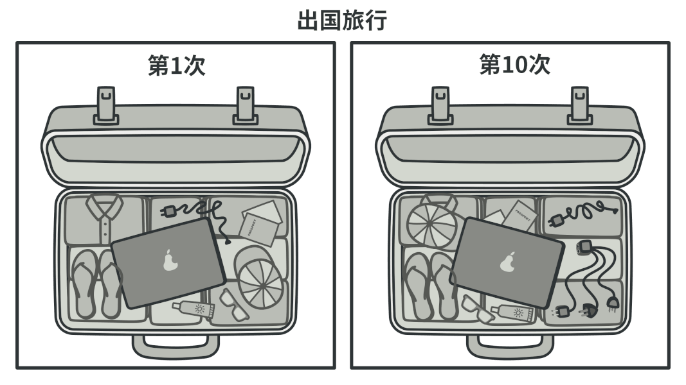

# 适配器模式

## 理解适配器模式

适配器模式（Adapter Pattern）充当两个不兼容接口之间的桥梁，属于结构型设计模式。它通过一个中间件（适配器）将一个类的接口转换成客户期望的另一个接口，使原本不能一起工作的类能够协同工作。

### 举例

* 电源适配器

    如果你是第一次从美国到欧洲旅行， 那么在给笔记本充电时可能会大吃一惊。 
    不同国家的电源插头和插座标准不同。 美国插头和德国插座不匹配。
    同时提供美国标准插座和欧洲标准插头的电源适配器可以解决你的难题。

* 音频适配器

  读卡器是作为内存卡和笔记本之间的适配器。您将内存卡插入读卡器，
  再将读卡器插入笔记本，这样就可以通过笔记本来读取内存卡。

## Java代码中使用适配器的例子
java.util.Arrays.asList

## 参考：
[适配器模式](https://refactoringguru.cn/design-patterns/adapter)

